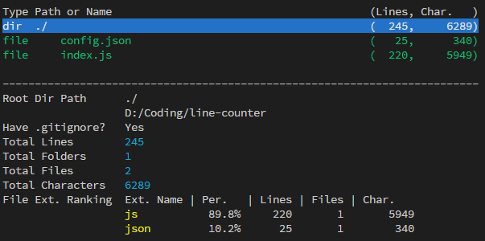

# line-counter

A CLI tool based on Node.js to **Count the line of code**, just that simple.



## Features

- **Colorful**: Easy to read.
- **Support `.gitignore`**: Ignore something like `node_modules` automatically.
- **File Extension Ranking**: Tell you what kind of languege you used the most.  

## How to use?

```
node line-counter <Yout project's path>
```
Whether the path is absolute or not, the line-counter will find it.

## Sample Output


```
Root Dir Path      ./project
                   Absolute/Path/To/The/Project
Have .gitignore?   Yes
Total Lines        3068
Total Folders      7
Total Files        32
Total Characters   75169
File Ext. Ranking  Ext. Name | Per.   | Lines | Files | Char.
                   js           98.7%    3029      28      74501
                   json          0.8%      25       1        465
                   html          0.3%      10       1        165
                   pug           0.1%       4       2         38
```

## Configuration

You can configure the line-counter via the `config.json`. Following are the possible value.

| Name   | Default Value | Meaning                             |
|--------|---------------|-------------------------------------|
| ignore | `array`       | To expand the `.gitignore`'s rules. |

## Dependencies

- [node-ignore](https://www.npmjs.com/package/ignore)
- [node-printf](https://www.npmjs.com/package/printf)

## License

Apache-2.0

```

   Copyright 2017 pp253

   Licensed under the Apache License, Version 2.0 (the "License");
   you may not use this file except in compliance with the License.
   You may obtain a copy of the License at

       http://www.apache.org/licenses/LICENSE-2.0

   Unless required by applicable law or agreed to in writing, software
   distributed under the License is distributed on an "AS IS" BASIS,
   WITHOUT WARRANTIES OR CONDITIONS OF ANY KIND, either express or implied.
   See the License for the specific language governing permissions and
   limitations under the License.
```
